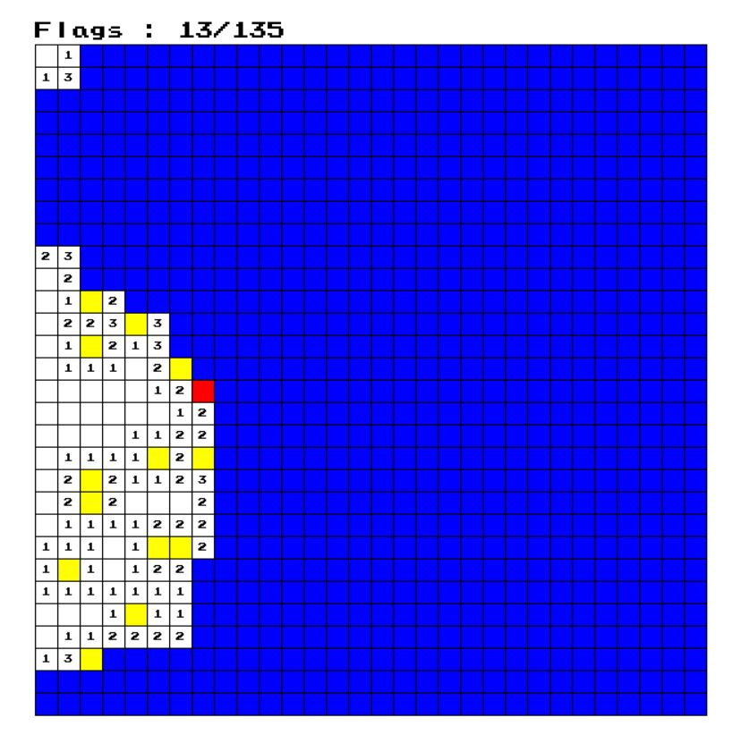
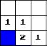
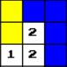

# AI
Here are my differents AI programs in C++ which implement and solve differents games like the minesweeper game, the sliding puzzle, sudoku, tic tac toe and the game of life

## Minesweeper
  I implemented the minesweeper, you have the choice to play the game or let the AI play by changing the value of the constant AI (line 10 from Démineur.cpp) to 1. If you want to play you can reveal a case with a left click and you can flag with a right click. The game is a 30x30 square randomly generated with 15% of bombs.

### Implementation of the AI : 
At first i wanted to implement dpll algorithm in order to solve all the solvable minsweeper but I decided to just implement an AI using 2 simple rules and see its efficency:
For each revealed case wich has unrevealed neighbors the AI count the number of unknown bombs and the number of unreveal neighbors (function KparmiN).

 - First rule

If there are as many unknown bombs as the number of unrevealed case, we can flag all the unrevealed neighbors. In the case there is 1 bomb for 1 unknown case so we can flag this case.

  - Second rule
  
  
  
  If there is 0 unknown bomb for n unrevealed cases, we can reveal them all. In this case the square in the middle tells us there are 2 bombs but there is 0 unknown bomb (2 cases flaged) so we can reveal all the unknown cases.
  
